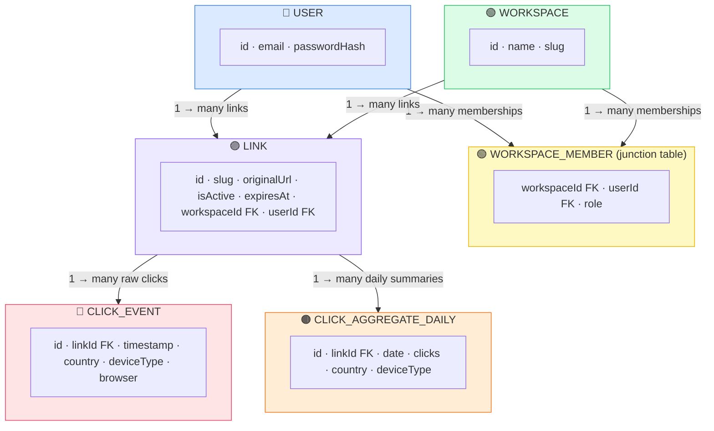
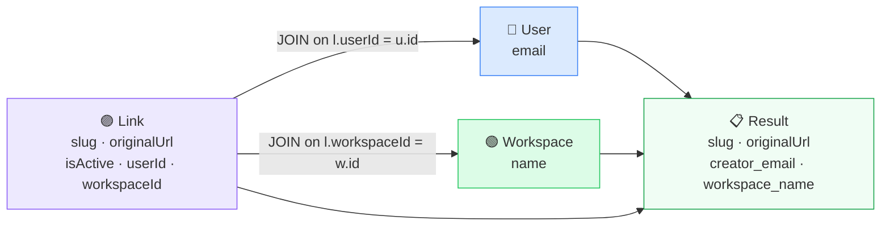
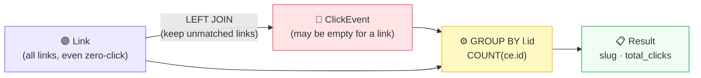
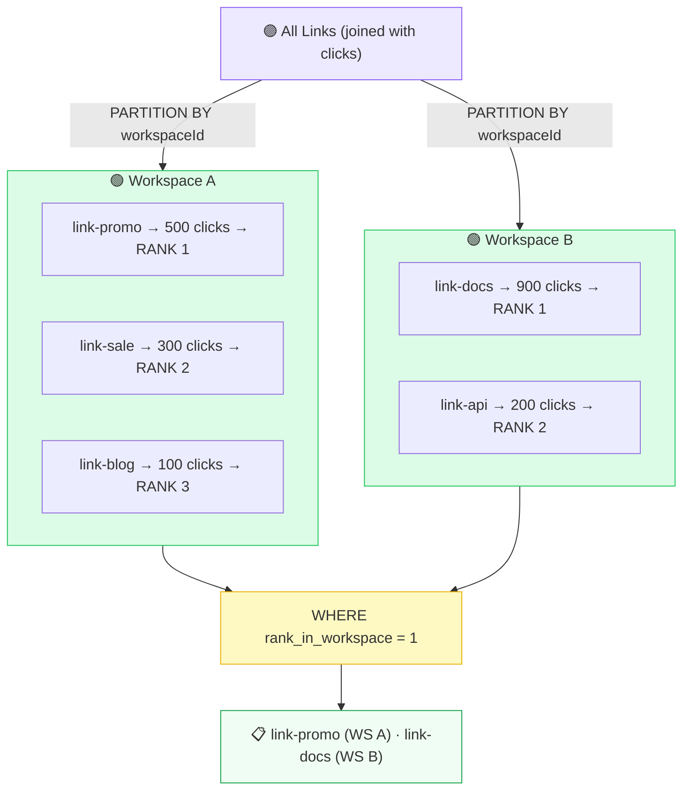
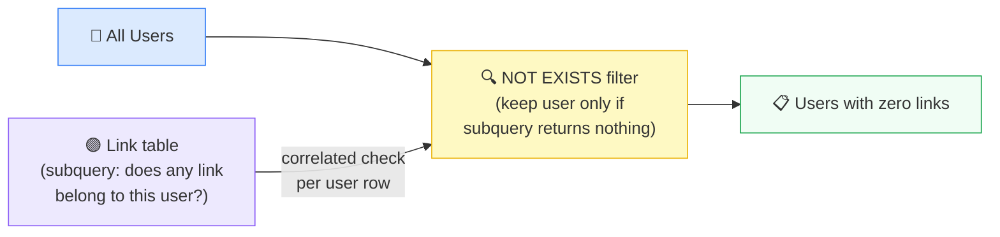
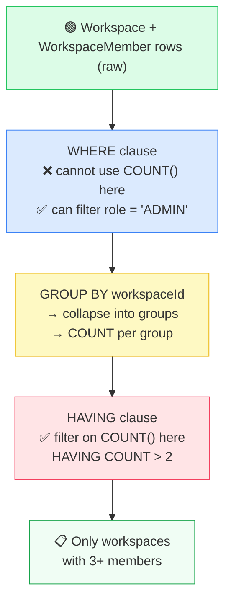
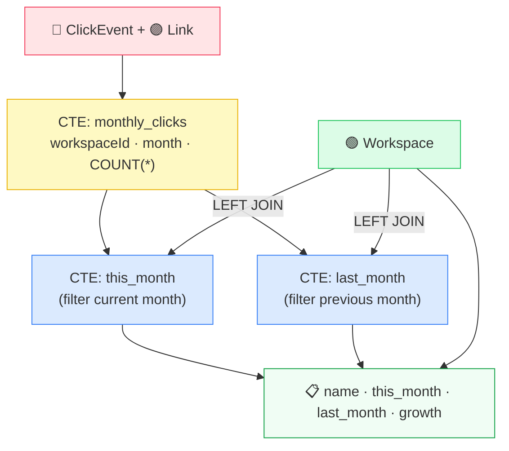
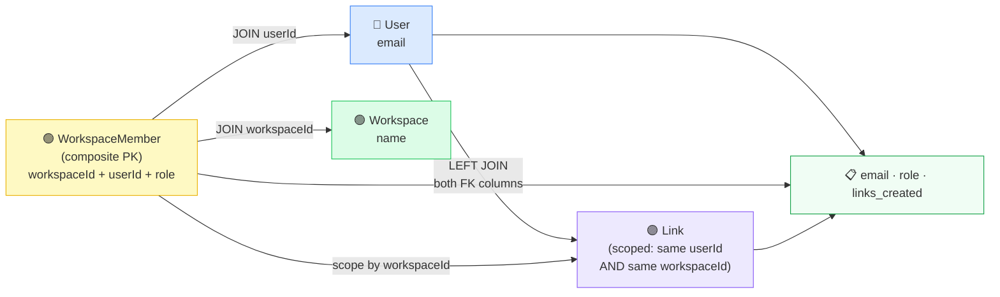
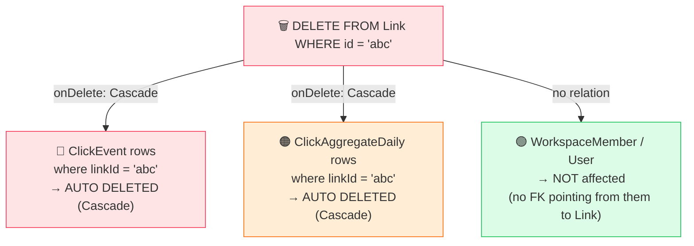

# LinkMetrics: Interview Queries & SQL Fundamentals Session

**Date:** 2026-05-28  
**Topic:** Core SQL queries connecting all schemas with beginner-friendly explanations

---

## Table of Contents

1. [Schema Overview](#schema-overview)
2. [Key Interview Queries (1-8)](#key-interview-queries)
3. [GROUP BY Deep Dive](#group-by-deep-dive)
4. [Query Patterns Quick Reference](#query-patterns-quick-reference)

---

## Schema Overview

### All 6 Tables in LinkMetrics

```
User ──< WorkspaceMember >── Workspace
User ──< Link >── Workspace
Link ──< ClickEvent
Link ──< ClickAggregateDaily
```

### Color Coding
- 🔵 **Blue** = User
- 🟢 **Green** = Workspace / WorkspaceMember
- 🟣 **Purple** = Link
- 🔴 **Red** = ClickEvent
- 🟠 **Orange** = ClickAggregateDaily

### Mermaid ER Diagram

Paste this into [mermaid.live](https://mermaid.live) to visualize:



---

## Key Interview Queries

### Query 1: Multi-table JOIN (Most Common Opener)

**Question:** "Show me every link, who created it, and which workspace it belongs to."

**What it tests:** Can you chain multiple JOINs without losing rows or duplicating them?

```sql
SELECT
    l.slug,
    l.originalUrl,
    u.email       AS creator_email,
    w.name        AS workspace_name
FROM "Link" l
JOIN "User"      u ON u.id = l."userId"
JOIN "Workspace" w ON w.id = l."workspaceId"
WHERE l."isActive" = true
ORDER BY l."createdAt" DESC;
```

**Flow Diagram** (paste into mermaid.live):



**Key Concepts:**
- `JOIN` = INNER JOIN — only returns rows that match on BOTH sides
- If a link had no user (impossible here due to FK constraint), it would be dropped
- `ORDER BY createdAt DESC` = newest first

---

### Query 2: COUNT + GROUP BY (Aggregate Queries)

**Question:** "How many total clicks has each link received?"

**What it tests:** Do you know `GROUP BY` rules — every non-aggregated column must be in `GROUP BY`?

```sql
SELECT
    l.slug,
    l."originalUrl",
    COUNT(ce.id) AS total_clicks
FROM "Link" l
LEFT JOIN "ClickEvent" ce ON ce."linkId" = l.id
GROUP BY l.id, l.slug, l."originalUrl"
ORDER BY total_clicks DESC;
```

**Why `LEFT JOIN` not `JOIN`?**

With `JOIN`, links that have **zero clicks** disappear from results. `LEFT JOIN` keeps them with `total_clicks = 0`.

**Flow Diagram:**



---

### Query 3: Window Functions - RANK() (Advanced Filter)

**Question:** "Rank links by click count within each workspace — show the top link per workspace."

**What it tests:** Understanding of `PARTITION BY`, `RANK()`, and filtering on window results.

```sql
WITH ranked AS (
    SELECT
        l.id,
        l.slug,
        w.name AS workspace_name,
        COUNT(ce.id) AS total_clicks,
        RANK() OVER (
            PARTITION BY l."workspaceId"
            ORDER BY COUNT(ce.id) DESC
        ) AS rank_in_workspace
    FROM "Link" l
    JOIN "Workspace" w ON w.id = l."workspaceId"
    LEFT JOIN "ClickEvent" ce ON ce."linkId" = l.id
    GROUP BY l.id, l.slug, w.name, l."workspaceId"
)
SELECT * FROM ranked WHERE rank_in_workspace = 1;
```

**How PARTITION BY works:**



**Key Insight:** `PARTITION BY` is like `GROUP BY` but it doesn't collapse rows — each row keeps its own rank score.

---

### Query 4: NOT EXISTS (Finding Absence)

**Question:** "Find all users who have never created a single link."

**What it tests:** `NOT EXISTS` vs `LEFT JOIN WHERE NULL` — both work, one is more readable.

```sql
-- Method A: NOT EXISTS
SELECT u.id, u.email
FROM "User" u
WHERE NOT EXISTS (
    SELECT 1 FROM "Link" l WHERE l."userId" = u.id
);

-- Method B: LEFT JOIN + NULL check (equivalent)
SELECT u.id, u.email
FROM "User" u
LEFT JOIN "Link" l ON l."userId" = u.id
WHERE l.id IS NULL;
```

**Flow Diagram:**



---

### Query 5: HAVING (Filtering After GROUP BY)

**Question:** "Show workspaces that have more than 2 active members."

**What it tests:** The difference between `WHERE` (filters rows *before* grouping) and `HAVING` (filters groups *after* aggregation).

```sql
SELECT
    w.id,
    w.name,
    COUNT(wm."userId") AS member_count
FROM "Workspace" w
JOIN "WorkspaceMember" wm ON wm."workspaceId" = w.id
GROUP BY w.id, w.name
HAVING COUNT(wm."userId") > 2
ORDER BY member_count DESC;
```

**The WHERE vs HAVING Rule:**



---

### Query 6: CTE - Common Table Expression (Complex Multi-Step)

**Question:** "For each workspace, show total clicks this month vs last month."

**What it tests:** Can you break a complex problem into readable steps with `WITH`?

```sql
WITH monthly_clicks AS (
    SELECT
        l."workspaceId",
        DATE_TRUNC('month', ce.timestamp) AS month,
        COUNT(*) AS clicks
    FROM "ClickEvent" ce
    JOIN "Link" l ON l.id = ce."linkId"
    GROUP BY l."workspaceId", DATE_TRUNC('month', ce.timestamp)
),
this_month AS (
    SELECT "workspaceId", clicks
    FROM monthly_clicks
    WHERE month = DATE_TRUNC('month', NOW())
),
last_month AS (
    SELECT "workspaceId", clicks
    FROM monthly_clicks
    WHERE month = DATE_TRUNC('month', NOW()) - INTERVAL '1 month'
)
SELECT
    w.name,
    COALESCE(tm.clicks, 0) AS this_month_clicks,
    COALESCE(lm.clicks, 0) AS last_month_clicks,
    COALESCE(tm.clicks, 0) - COALESCE(lm.clicks, 0) AS growth
FROM "Workspace" w
LEFT JOIN this_month tm ON tm."workspaceId" = w.id
LEFT JOIN last_month lm ON lm."workspaceId" = w.id
ORDER BY growth DESC;
```

**CTE Flow:**



---

### Query 7: Composite Key JOIN (Junction Table Pattern)

**Question:** "List all members of a workspace with their role and how many links they've created in that workspace."

**What it tests:** Joining on composite primary keys and understanding junction tables.

```sql
SELECT
    u.email,
    wm.role,
    COUNT(l.id) AS links_created
FROM "WorkspaceMember" wm
JOIN "User"      u ON u.id = wm."userId"
JOIN "Workspace" w ON w.id = wm."workspaceId"
LEFT JOIN "Link" l
    ON l."userId" = wm."userId"
    AND l."workspaceId" = wm."workspaceId"  -- scoped to this workspace only
WHERE wm."workspaceId" = 'your-workspace-id'
GROUP BY u.id, u.email, wm.role
ORDER BY wm.role, links_created DESC;
```

**Junction Table Pattern:**



---

### Query 8: Cascade Delete (Schema Design Question)

**Question:** "What happens when a Link is deleted?"

**What it tests:** Do you understand `onDelete: Cascade` and its consequences?



**Schema Notes:**

The Prisma schema has `onDelete: Cascade` on:
- `ClickEvent.link` 
- `ClickAggregateDaily.link`

**Result:** Delete a link → all its raw clicks and daily summaries are automatically deleted.

---

## GROUP BY Deep Dive

### The Problem GROUP BY Solves

Imagine your `ClickEvent` table:

```
id    | linkId      | timestamp
------|-------------|----------
ce1   | link-abc    | 10:01
ce2   | link-abc    | 10:05
ce3   | link-abc    | 10:09
ce4   | link-xyz    | 11:00
ce5   | link-xyz    | 11:30
```

**Question:** How many clicks did each link get?

The database sees **5 separate rows**. Without `GROUP BY`, it doesn't know you want them **grouped together by linkId** before counting.

### Visualizing GROUP BY

```
BEFORE GROUP BY             AFTER GROUP BY linkId
(5 raw rows)                (2 groups, 1 row each)

ce1 → link-abc              link-abc → COUNT = 3
ce2 → link-abc         →
ce3 → link-abc

ce4 → link-xyz              link-xyz → COUNT = 2
ce5 → link-xyz         →
```

### The Query Step-by-Step

```sql
SELECT
    l.slug,           -- the short name of the link (e.g. "my-promo")
    l."originalUrl",  -- the full destination URL
    COUNT(ce.id) AS total_clicks  -- count how many click rows exist per group
```

**What to SELECT** — the columns you want in your final answer.
- `COUNT(ce.id)` = count the number of ClickEvent rows in each group.

---

```sql
FROM "Link" l
```

Start with the Link table. Nickname it `l` to save typing.

---

```sql
LEFT JOIN "ClickEvent" ce ON ce."linkId" = l.id
```

For every link, **attach** its matching click rows.

- `LEFT JOIN` means: *even if a link has zero clicks, keep it in the results* (with `total_clicks = 0`).
- A regular `JOIN` would have silently deleted those zero-click links from your results.

**Visually:**

```
Link table            ClickEvent table
----------            ----------------
link-abc      ←────  ce1 (linkId = link-abc)
              ←────  ce2 (linkId = link-abc)
              ←────  ce3 (linkId = link-abc)

link-xyz      ←────  ce4 (linkId = link-xyz)
              ←────  ce5 (linkId = link-xyz)

link-no-clicks ←─── (nothing — LEFT JOIN keeps it anyway)
```

After the join, the database is holding **one big flat table** with repeated link info:

```
l.slug     | l.originalUrl      | ce.id
-----------|--------------------|---------
my-promo   | https://shop.com   | ce1
my-promo   | https://shop.com   | ce2
my-promo   | https://shop.com   | ce3
my-xyz     | https://docs.com   | ce4
my-xyz     | https://docs.com   | ce5
silent     | https://quiet.com  | NULL
```

---

```sql
GROUP BY l.id, l.slug, l."originalUrl"
```

**Now collapse the repeated rows.**

"For every unique combination of `id + slug + originalUrl`, merge all their rows into one, and let me use `COUNT()` on the group."

After grouping:

```
l.slug     | l.originalUrl      | COUNT(ce.id)
-----------|--------------------|-------------
my-promo   | https://shop.com   | 3
my-xyz     | https://docs.com   | 2
silent     | https://quiet.com  | 0   ← LEFT JOIN preserved it
```

---

```sql
ORDER BY total_clicks DESC;
```

Sort the result so the most-clicked link appears first. `DESC` = highest to lowest.

### The Golden Rule of GROUP BY

> **Every column in your SELECT must either be:**
> 1. Inside an aggregate function like `COUNT()`, `SUM()`, `AVG()`, or
> 2. Listed in your `GROUP BY`

**Why?**

If you tried `SELECT l.createdAt` but forgot to add it to `GROUP BY`, the database throws an error because it doesn't know *which* `createdAt` to show when 3 rows got merged into 1.

**Example of WRONG:**
```sql
-- ❌ WRONG: createdAt is not in GROUP BY
SELECT
    l.slug,
    l.createdAt,  -- ERROR: which one?
    COUNT(ce.id)
FROM "Link" l
LEFT JOIN "ClickEvent" ce ON ce."linkId" = l.id
GROUP BY l.id, l.slug;  -- createdAt missing!
```

**Example of CORRECT:**
```sql
-- ✅ CORRECT: all non-aggregated columns in GROUP BY
SELECT
    l.slug,
    l.createdAt,
    COUNT(ce.id)
FROM "Link" l
LEFT JOIN "ClickEvent" ce ON ce."linkId" = l.id
GROUP BY l.id, l.slug, l.createdAt;
```

---

## Query Patterns Quick Reference

| # | Pattern | Tables | Tests | Key Concept |
|---|---------|--------|-------|------------|
| 1 | Multi-table JOIN | User + Link + Workspace | INNER JOIN chaining | Can chain JOINs correctly |
| 2 | COUNT + LEFT JOIN | Link + ClickEvent | LEFT JOIN for zeros | Understanding join types |
| 3 | RANK() OVER PARTITION | Link + ClickEvent + Workspace | Window functions | Per-group ranking |
| 4 | NOT EXISTS | User + Link | Absence detection | Subquery correlation |
| 5 | HAVING | Workspace + WorkspaceMember | Post-group filtering | WHERE vs HAVING |
| 6 | CTE (WITH) | ClickEvent + Link + Workspace | Multi-step logic | Breaking down complexity |
| 7 | Composite JOIN | WorkspaceMember + User + Link | Junction tables | Multi-column FKs |
| 8 | Cascade Delete | Link + ClickEvent + ClickAggregateDaily | Schema design | FK constraints |

---

## Next Steps

1. **Test each query** against your local database
2. **Modify the WHERE clauses** to practice filtering
3. **Add more aggregate functions** — `SUM()`, `AVG()`, `MIN()`, `MAX()`
4. **Combine queries** — use `UNION`, `INTERSECT`, `EXCEPT`
5. **Practice window functions** — `ROW_NUMBER()`, `DENSE_RANK()`, `LAG()`, `LEAD()`

---

**Session Generated:** 2026-05-28  
**Schema:** LinkMetrics (URL Shortener with Analytics)  
**Database:** PostgreSQL
